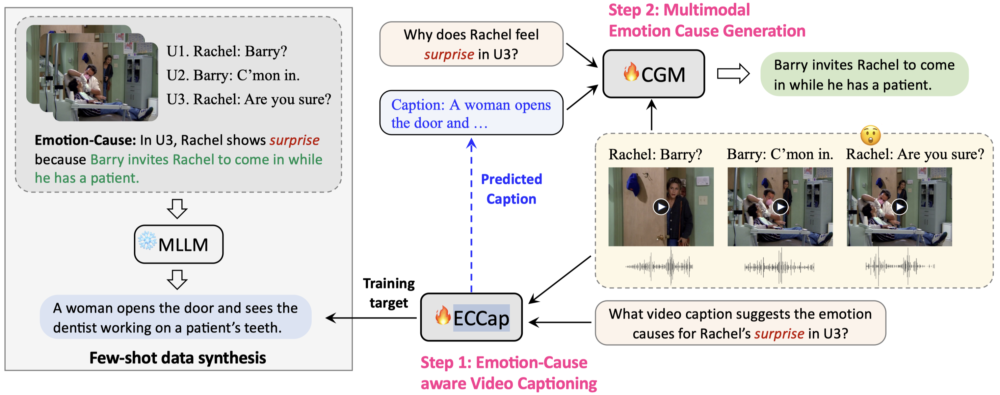
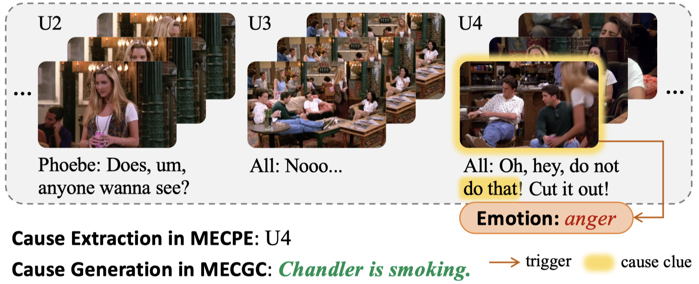
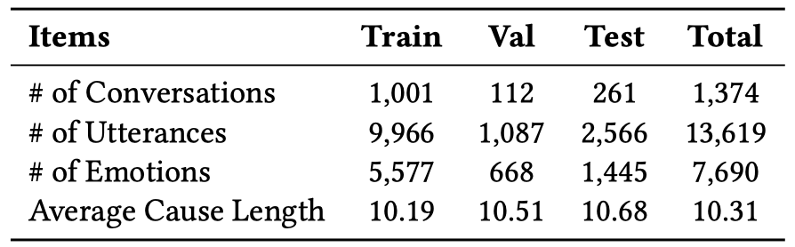

# Observe before Generate: Emotion-Cause aware Video Caption for Multimodal Emotion Cause Generation in Conversations

***Fanfan Wang***, ***Heqing Ma***, ***Xiangqing Shen***, ***Jianfei Yu***\*, ***Rui Xia***\*

[](https://huggingface.co/datasets/NUSTM/ECGF) [](https://dl.acm.org/doi/10.1145/3664647.3681601)

This repository contains the code for **ObG**, a multimodal pipeline framework that first generates emotion-cause aware video captions (Observe) and then facilitates the generation of emotion causes (Generate).




## Task

**Multimodal Emotion Cause Generation in Conversations (MECGC)** aims to generate the abstractive causes of given emotions based on multimodal context.




## Dataset

[**ECGF**](https://huggingface.co/datasets/NUSTM/ECGF) is constructed by manually annotating the abstractive causes for each emotion labeled in the existing [ECF](https://github.com/NUSTM/MECPE/tree/main/data) dataset.




## Requirements

```
conda env create -f environment.yml
conda activate obg

# install nlgeval for evaluation
pip install git+https://github.com/Maluuba/nlg-eval.git
```


## Usage

### 1. Emotion-cause aware video captioning

#### Few-shot Data Synthesis

Gemini-Pro-Vision is used to generate emotion-cause aware video captions as supervised data for training ECCap. For the detailed instruction template, please refer to Figure 3 in our paper. 

#### Data Format

```
{
    "emo_utt_id": "dia14utt4",
    "input": "question: What visual caption suggests the emotion causes for All's anger in U4? \\ context: U1. <extra_id_1> <extra_id_51> Chandler: xxx | U2. <extra_id_2> <extra_id_52> Phoebe: xxx | U3. <extra_id_3> <extra_id_53> All: xxx | U4. <extra_id_4> <extra_id_54> All: xxx",
    "output": "A man is smoking."
}
```
_Note_: 'xxx' refers to the utterance text, and the context window is [-3, 0].

#### Model Training

```
# modify the data_dir, output_dir
bash ECCap.sh
```

### 2. Multimodal emotion cause generation

#### Data Format

```
{
    "emo_utt_id": "dia14utt4",
    "input": "question: Why does All feel anger in U4? \\ caption: xxx \\ context: U1. <extra_id_1> <extra_id_51> Chandler: xxx | U2. <extra_id_2> <extra_id_52> Phoebe: xxx | U3. <extra_id_3> <extra_id_53> All: xxx | U4. <extra_id_4> <extra_id_54> All: xxx | U5. <extra_id_5> <extra_id_55> Rachel: xxx | U6. <extra_id_6> <extra_id_56> Chandler: xxx",
    "output": "Chandler is smoking."
}
```
_Note_: The context window is [-5, 2].

#### Model Training

```
# modify the data_dir, output_dir
bash CGM.sh
```


## Citation

```
@inproceedings{wang2024obg,
  title={Observe before Generate: Emotion-Cause aware Video Caption for Multimodal Emotion Cause Generation in Conversations},
  author={Wang, Fanfan and Ma, Heqing and Shen, Xiangqing and Yu, Jianfei and Xia, Rui},
  booktitle={Proceedings of the 32st ACM International Conference on Multimedia},
  pages={},
  year={2024}
}

@ARTICLE{ma2024monica,
  author={Ma, Heqing and Yu, Jianfei and Wang, Fanfan and Cao, Hanyu and Xia, Rui},
  journal={IEEE Transactions on Affective Computing}, 
  title={From Extraction to Generation: Multimodal Emotion-Cause Pair Generation in Conversations}, 
  year={2024},
  volume={},
  number={},
  pages={},
  doi={10.1109/TAFFC.2024.3446646}
}
```

## Acknowledgements

Our code benefits from [VL-T5](https://github.com/j-min/VL-T5) and [CICERO](https://github.com/declare-lab/CICERO/blob/fe728706e6faf0a1a4511e56180951174408c870/v1/experiments/nlg/evaluate.py). We appreciate their valuable contributions.
